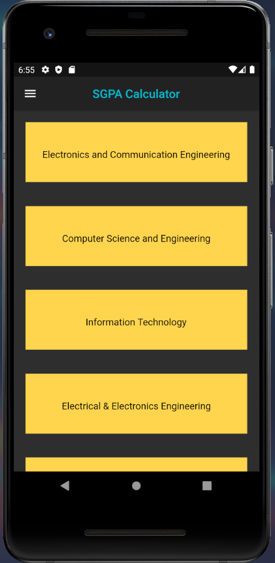
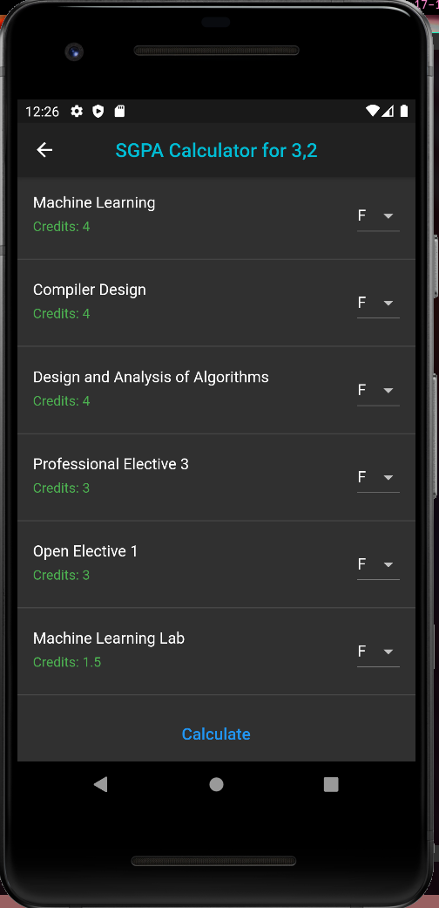
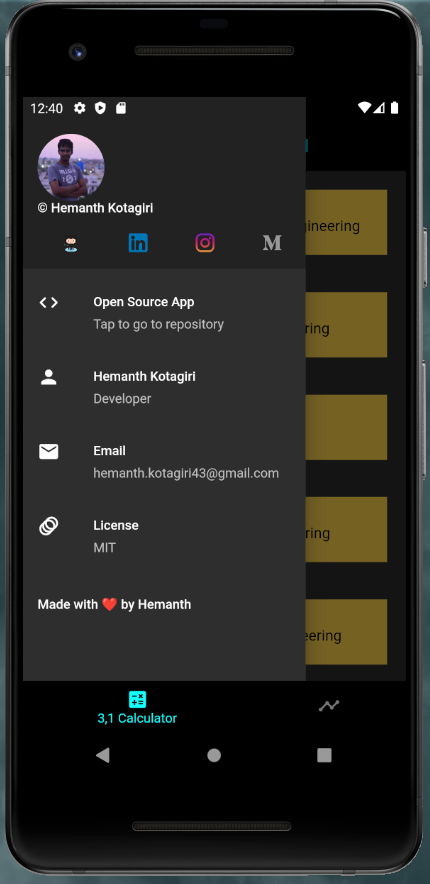

## SGPA-Calculator Flutter Application

  
  
  

### A cross-platform application built using Flutter to calculate stream-specific GPA.

As of now, this application is specifically targetted to Junior Year students of JNTUH of those who are in R18 Regulation.

I have also developed a [RESTful API](https://github.com/hemanth-kotagiri/sgpa-rest-api) for this application
with which, results of all semesters of Freshman, Sophomore, Junior and Senior can be fetched.

### Upcoming Features

More features to this application are on their way, some of them are :

- Single field results fetcher.
  That is, just with the hallticket number, the results shall be fetched using the RestAPI and the subjects are laid out.
- Database integration - Ability to store the results that have already been fetched/calculated.

Feel free to contribute to this project!

[MIT License](LICENSE) - Copyright (c) 2021 Hemanth Kotagiri

Made with ❤️ by Hemanth
