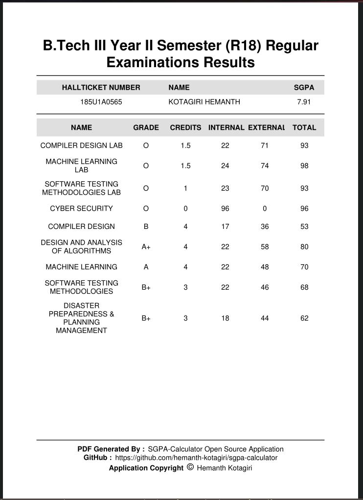

  
  
  
  
  
  

 

<h1>SGPA Calculator</h1>
A cross-platform application built using Flutter to calculate stream-specific
GPA. This application provides the results for all JNTUH students of all
regulations, of all types ( regular and supplementary ).
 
 

  
  
  
  
  
  

### Search

### Individual Pages

  
  

### Generated PDF File

  
  

### Backend

I have also developed a [RESTful API](https://github.com/hemanth-kotagiri/sgpa-rest-api) for this application
with which, results of all regular semesters of Freshman, Sophomore, Junior and Senior can be fetched.
Here's the [API Documentation](https://hemanth-kotagiri.github.io/sgpa-rest-api-docs).

### Features

- [x] Results of all exams - _**I mean, every single one of them.**_
  - [x] Support for all regulations.
  - [x] Regular Results.
  - [x] Supplementary Results.
  - [x] Advance Supplementary Results.
  - [x] RC/RV Results.
- [x] special results page specifically for R18 Regular Exam Results.
- [x] Latest Notifications from JNTUH.
- [x] Database integration - Ability to store the results that have already been fetched/calculated.
- [x] Export result as PDF.

### Alpha Testers & UI/UX

- [Navaneeth Kumar](mailto:kumarnavaneeth8@gmail.com)
- [Akash Reddy](https://github.com/Akashreddy9876)

Feel free to contribute to this project in whatever way you wish to! PRs are also welcome!

<a href="https://www.flaticon.com/free-icons/grade" title="grade icons">Grade icons created by DinosoftLabs - Flaticon</a>

[MIT License](LICENSE) - Copyright (c) 2022 Hemanth Kotagiri

This project has been solely developed by me without any external influence by
a person or an organization or university whatsoever, and if in the case of any
upcoming contributions, they are also equally regarded as developers of this
project.

Contributions are always welcome! Feel free to pick up tasks from the project
section and raise a PR. Please raise an issue regarding the task that you
would like to pick up and link the PR(s) for the same.

Made with ❤️ by Hemanth.

> I started this for you, only for you. Now, it serves for a greater purpose -
> for so many students ahead. You shall be remembered forever, in the
> reminiscence of this project.

> **_For Precious, with Patience._**
