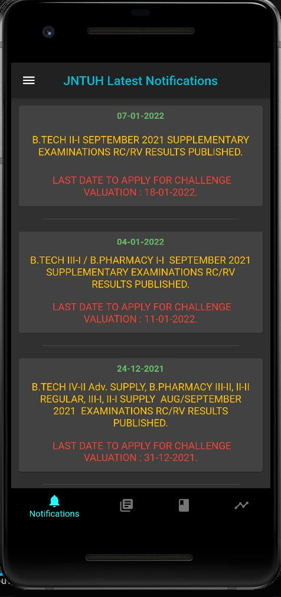
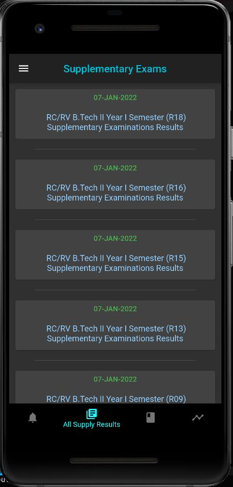

## SGPA-Calculator Flutter Application

  
  
  
  
  

### A cross-platform application built using Flutter to calculate stream-specific GPA.

As of now, this application is specifically targetted to Junior Year students of JNTUH of those who are enrolled in the R18 Regulation.

I have also developed a [RESTful API](https://github.com/hemanth-kotagiri/sgpa-rest-api) for this application
with which, results of all regular semesters of Freshman, Sophomore, Junior and Senior can be fetched.

### Upcoming Features

More features to this application are on their way, some of them are :

- [ ] Results of all exams
  - [ ] Support for all regulations.
  - [ ] Regular Results.
  - [ ] Supplementary Results.
  - [ ] Advance Supplementary Results.
  - [ ] RC/RV Results.
- [ ] A special results page specifically for R18 Regular Exam Results.
- [ ] Database integration - Ability to store the results that have already been fetched/calculated.

### Alpha Testers & UI/UX

- [Navaneeth Kumar](mailto:kumarnavaneeth8@gmail.com)
- [Akash Reddy](https://github.com/Akashreddy9876)

Feel free to contribute to this project in whatever way you wish to! PRs are also welcome!

[MIT License](LICENSE) - Copyright (c) 2022 Hemanth Kotagiri

This project has been solely developed by me without any external influence by
a person or an organization or university whatsoever, and if in the case of any
upcoming contributions, they are also equally regarded as developers of this
project.

Contributions are always welcome! Feel free to pick up tasks from the project
section and raise a PR. Please raise an issue regarding the task that you
would like to pick up and link the PR(s) for the same.

Made with ❤️ by Hemanth.

> For Precious, with Patience.
